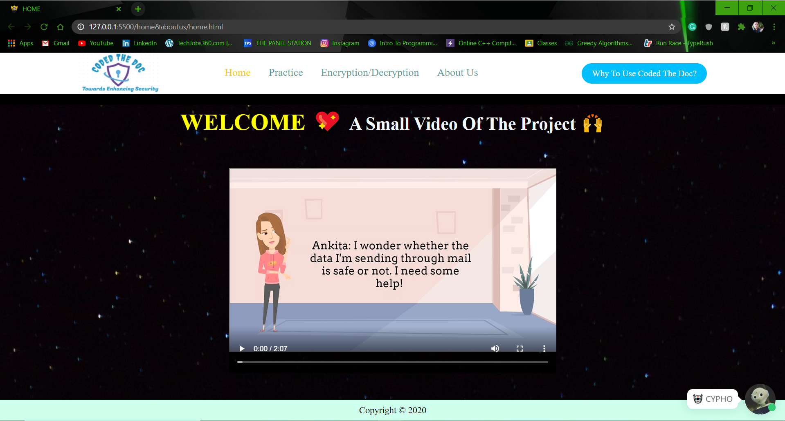
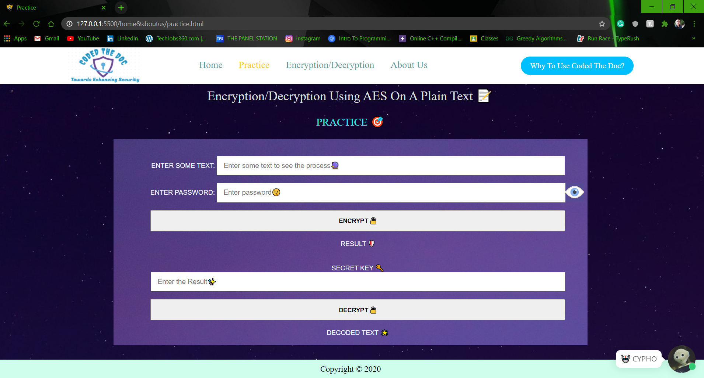
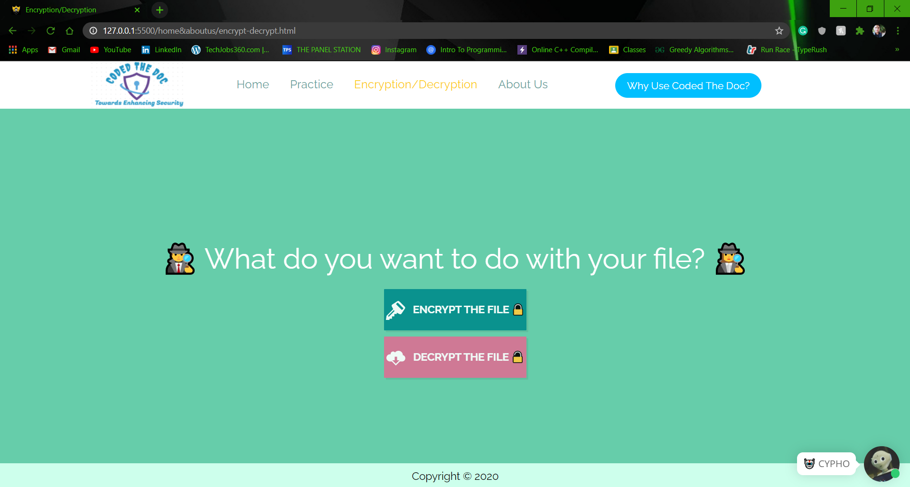
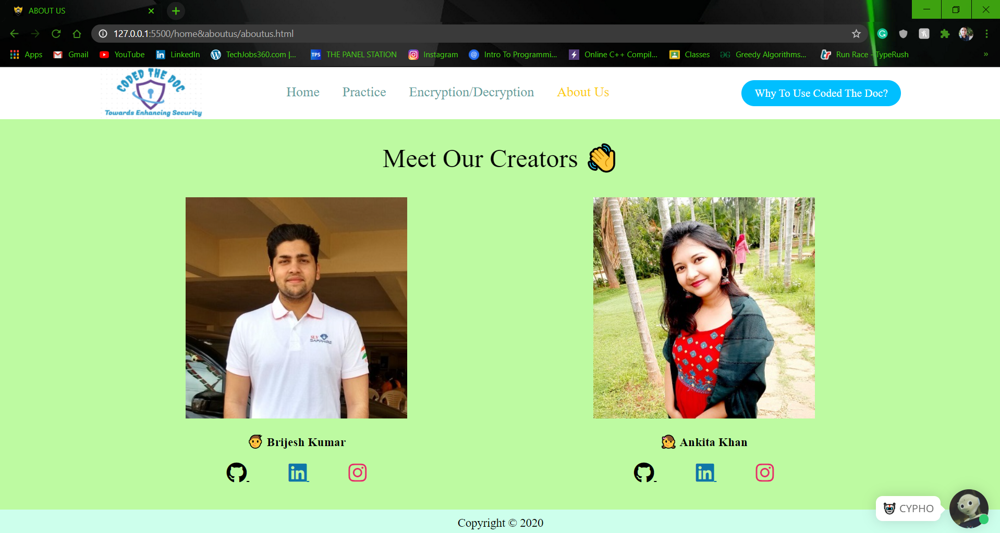

# CODED_THE_DOC
✨ It is a simple application to encrypt any document or any text using AES algorithm. 
✨ Web application with upload and download features of document for encryption and decryption using secret key. 
✨ It also has an live chatbot🤖 to solve common human queries. 
✨ Link to the video demo: https://drive.google.com/file/d/16x7n06uz0IGArzPUqxTLOBABnS06YNAc/view?usp=sharing  
 

☀️ Technologies Used 
<code></code>
<code></code>
<code></code>  
 
✅ Steps To Use It 
👉 Clone the repository. 
👉 Make sure to have either VS Code or any other editor that supports HTML, CSS & JS technologies. 
👉 Then, you can operate the application. 
 
 
✔️ Sections 
🏠 HOME 
🎯 PRACTICE 
⚙️ ENCRYPTION/DECRYPTION 
🌟 ABOUT US 
 
 
🤦‍♂️ Limitation 
☢️ File can shouldn't be more than 1MB. 
 
 
🖼️ SNAPSHOTS  
🏠 HOME  
  
🎯 PRACTICE  
  
⚙️ ENCRYPTION/DECRYPTION  
  
🌟 ABOUT US  
  
 
💖CREATORS 
<strong>
<a href = "https://github.com/brijeshsos66">Brijesh Kumar</a>
<a href = "https://github.com/ANKITAKHAN">Ankita Khan</a>
</strong>
